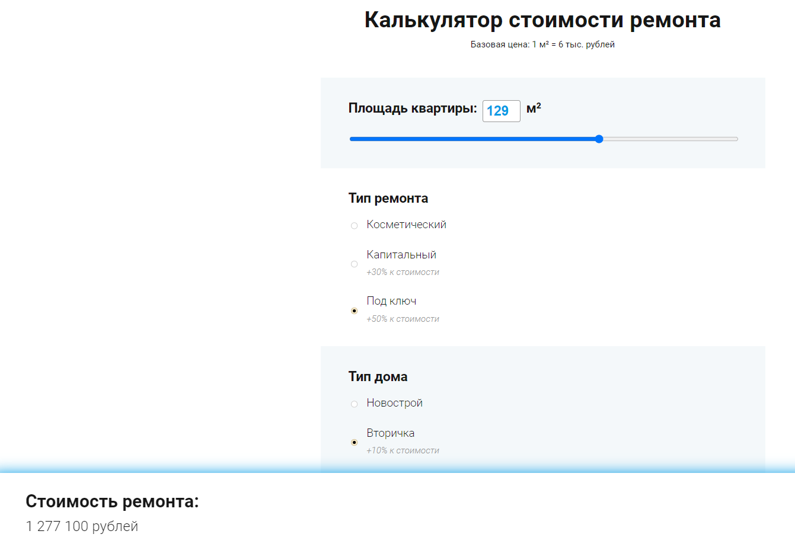
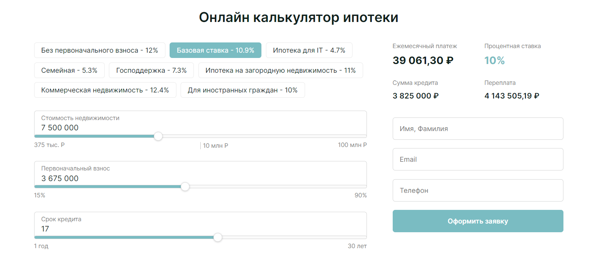

#JS projects

1. Расчёт стоимости ремонта квартиры  

Проект, где пользователь может ввести площадь недвижимости (при помощи взаимосвязанных input / бегунка) и увидеть базовую стоимость ремонта из расчёта 6000 за 1кв м. Также ниже представленный кастомизированные радиокнопки и чекбоксы, которые имеют не дефолтный вид, а также описание насколько они могут увеличить/снизить стоимость. При клике пользователь сразу же может видеть предварительную стоимость проекта.
 
Посмотреть онлайн: https://codepen.io/AlinaK96/pen/xxyrbWQ  
 

 
 

2. Онлайн калькулятор для расчёта ипотеки  

В проекте представлено несколько ипотечных ставок по различным условиям. Пользователь может выбрать стоимость недвижимости, первый взнос, а также срок кредитования. При изменение сумм, ежемесячный платёж будет автоматически пересчитываться. При выборе ставки кредитования и суммы, ежемесячный платёж высчитывается автоматически и клиет видит минимальный необходимый платёж из расчёта (min - 15%; max - 90%). Все суммы пользователь может как вводить, так и перетаскивать бегунок.  
 
При каждом изменении суммы в правом углу будет пересчитываться ежемесячный платёж, сумма кредитования и сумма переплаты.
Здесь также добавлена возможность подать заявку, а данные будут отправляться на указанную администратором страницу. 
 
Репозиторий проекта: https://github.com/AlinaK96/MortgageCalculator  
Посмотреть онлайн: https://alinak96.github.io/MortgageCalculator/  
 

 

3. Доставка суши (версия 1.0)  
 

Проект, где пользователь может выбрать суши, которые он хочет доставить, а также её количество. После того, как пользователь добавил товар в корзину, он видит стоимость товаров и сумму доставки 
 

Репозиторий проекта: https://github.com/AlinaK96/SushiDelivery  
Посмотреть онлайн: https://alinak96.github.io/SushiDelivery/  
 

